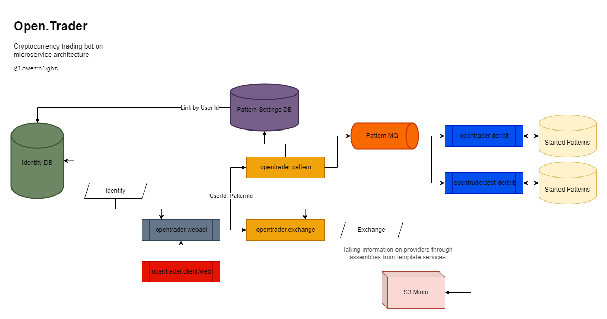

---

# OpenTrader `Platform`

**OpenTrader** is an advanced cryptocurrency trader bot based on _microservice architecture_. 
It is a powerful solution that utilizes a wide range of advanced technologies. 
The project is built on `asp.net core` on `.net 8`, which ensures its reliability and high performance. 
`Docker` is used to build, deploy and run applications using containers,
making the development process more efficient.
The postgres database provides storage and processing of large amounts of data,
providing fast and reliable access to it. `RabbitMq` is used for message processing,
ensuring reliable data transfer between different parts of the system. `Remix` with `Vite` is used for client-side rendering, 
providing high performance and user-friendliness.
The project also uses `nginx` as a reverse proxy, 
which provides security and flexibility when dealing with web traffic. 
An important feature of the project is separate handlers for each cryptocurrency API provider. 
This ensures maximum compatibility and flexibility when working with different cryptocurrencies.

## Deploy

> Read this documentation [build documentation](BUILD.md)

## UML Diagram

> Example scheme of the infrastructure that will be used for the development of this application

### Description about _Diagram_

1. **Identity** - Built in web api. I didn't see the need to put it in a separate service
2. **Exchange** - Located in a third-party service and collects information about providers from assemblies 
   of services, when adding a new provider should 
   add a link to the project and specify it in the code proper

### Why is that

1. Single message broker for templates - The message broker forwards a small number of messages to the endpoints. 
But the services themselves are already involved in complex template processing

### Git Decoration

> 
[issues/task](type-commit{fix/bugfix/feature/refactor}): and description
